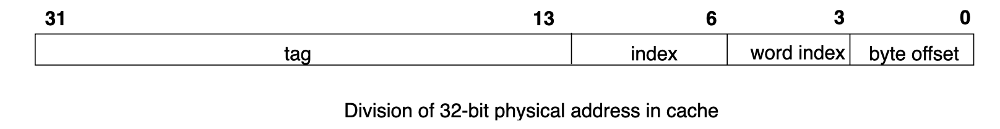
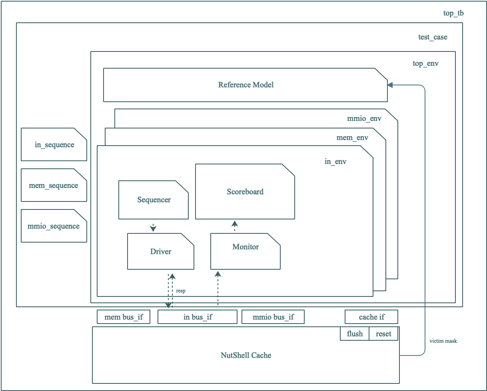

# uvm-cache

## 介绍

基于 UVM 的 NutShell Cache 验证平台，Cache 拆解自 [NutShell](https://github.com/OSCPU/NutShell/tree/master)，由 [mcv-ut](https://gitee.com/yaozhicheng/mcv-ut) 拆解。

### 运行依赖
- vcs
- uvm-1.1d

### 运行方法

配置 `$UVM_HOME`

```shell
git clone "https://gitee.com/Miical/uvm-cache"
cd uvm-cache
make init
make

# 其他选项
# 编译并运行图形化界面
make gui

# 编译运行并打开覆盖率统计窗口
make cov
```


## NutShell Cache 介绍

Cache 模块分为存储部分 (Cache Array) 和控制逻辑部分 (control logic). 其中存储部分又可以分为元数据 (Meta Array) 和数据 (Data Array). 控制逻辑部分被划分分为三级流水线, 对外会提供对 Memory Mapped Input/Output (MMIO) 空间、Memory 空间的访问接口。

- 存储数据大小：32kb
- 映射策略：四路组相联映射
- 替换策略：随机替换, 写回
- 每个 Cache 行的大小为 64B
- 地址划分：
    

### 信号细节：

1. 高电平有效。
2. 总线采用 Simplebus 总线，在 Cache 给出 req_ready 信号时，可以向 Cache 发出请求，Cache 会在时钟上升沿进行读取 req_valid，若有效则立即读取请求。
3. Cache 开始运行后会花费较长周期对 RAM 进行初始化，之后 in 端口才会发出 req_ready 信号。
4. Cache 请求读内存时，由于每个 Cache line 可以存储 64B，而总线每次只能发送 8B，因此内存在接到 Cache 请求时需在8个时钟周期内持续将 valid 置为有效，并在每个周期内顺序将 8 个 8B 数据发出，最后一个周期将命令置为 ReadLast 以停止发送。需要注意的是，Cache 采用的关键字优先技术，请求中的地址为用户请求的地址，内存需首先该地址的数据返回，然后依次返回下面的地址，内存返回的是本组内的 8 个 8 字节数据，到达末尾后应将地址循环到本组首地址，继续顺序返回。
5. Cache 请求写内存时，会从本组首地址开始，依次向内存发出8个请求（每个请求都标注首地址），将一个 cache line 内的数据写回。
6. 读写不论 Size。无论大小，都只请求/回复一次。
7. Cache Miss 发生时，如果有 invalid 行，则不发生替换，如果一组内有多个 invalid 行，则按照索引从大到小的方式去填充，如果没有 invalid 行，会按照 victimWaymask 信号所指示的索引，替换对应缓存行。victimWaymask 在 stage2 io_in_valid 时有效。
8. mmio 地址空间为 32'h30000000 至 32'h7fffffff。读 mmio 时必定 miss，并直接将请求转发至 mmio，不涉及访问内存时的规则。

## 验证平台结构

平台结构如下



### 实现细节

1. 平台搭建了 3 个 environment，分别对上层请求端、mem端、mmio端进行了模拟，依据上层的不同请求搭建测试用例。
2. 三种总线事务，REQ、RESP 和 MEM_RESP。
   - monitor 和 driver 可以由事务类型来直接配置驱动和检测的事件类型。
   - 由于 Memory Sequence 需要根据 Cache 请求来确定输出，因此在 driver 中增设 response，驱动总线信号后，返回总线输出。
   - monitor 根据检测对象的 valid 信号变化来产生事务，每当 valid 信号变为有效，monitor 工作一次。
   - 为避免 Reset 功能所带来的 Response 混乱，在驱动 reset 时，没有回复信号。
3. 与内存之间的 64B 数据交互被封装在事务中，可以直接由 monitor 和 driver 进行驱动，为了模拟 DUT 的关键字优先，monitor 监测内存读时，返回两个事务，第一个事务包含用户请求的数据，第二个事务包含内存发送的完整 64 的数据（可以保证比 DUT 更快产生回复）。
4.  Reference Model 中，由于随机替换策略无法模拟，因此在 DUT 中导出了信号，直接连接至 Reference Model，用于获取替换信号。
5.  Reference Model 和 DUT 使用同一个 mem 和 mmio 环境，Reference Model 输出的信号不作用于 mem 和 mmio，只会输出至 scoreboard 与 DUT 进行对比。
